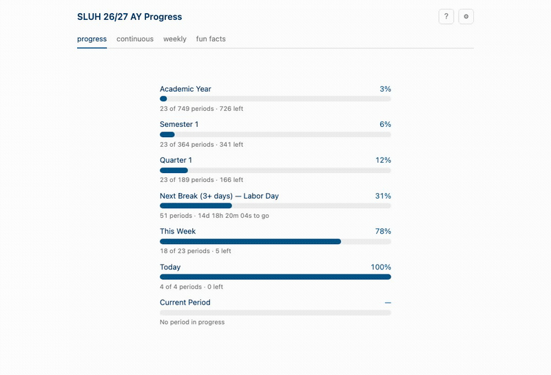
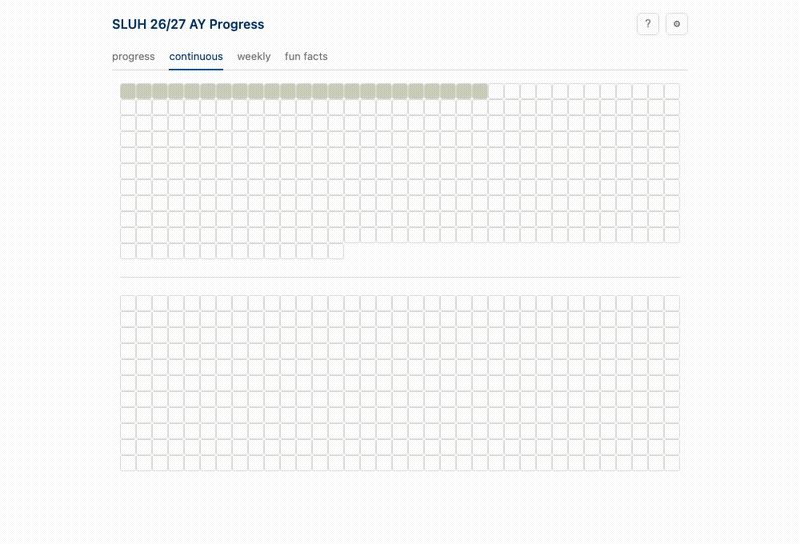
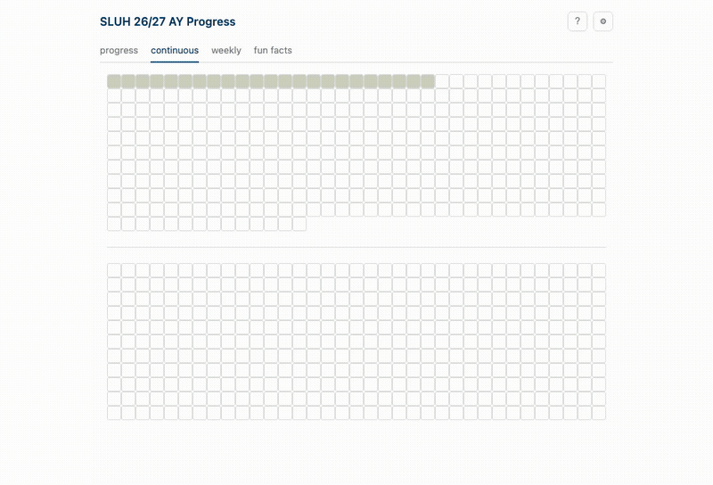

# SLUH Time Visualizer

A single-page, no-build website that shows the shape of the school year as a
grid of squares — one per class period — filling in as the day, week,
semester, and year progress. Meant to be bookmarked as a start page.

## How it works

Four tabs, each independently linkable — add `#progress`, `#continuous`,
`#weekly`, or `#current` to the URL to land straight on that view (handy if
you want, say, the continuous grid specifically as your start page):



- **Progress** — stacked bars for Academic Year, current Semester, current
  Quarter, **Next Break** and the **Winter Break / End of Year** milestone
  bar (both below), This Week, Today, and a live **Current Period** bar
  with an elapsed/remaining timer for whatever's happening right now.
- **Continuous** — every period of the year in one seamless grid, in
  order, sized to fill the screen on desktop. No gaps between days.
- **Weekly** — the same data laid out as one row per calendar week, Mon–Fri
  as fixed columns, so a short week (a holiday, a break) shows up as
  visibly empty columns instead of just vanishing.
- **Current Period** — just the live Current Period bar, full-size, for
  a glance at how much of the period is left without anything else on
  screen.

The **Next Break** bar is for anyone counting down to the next stretch of
3 or more consecutive calendar days off (a PD day or parent-teacher
conference next to a weekend doesn't count — it's still a workday, so it
can't create or extend a break). It shows school days left, counted in
actual school days rather than raw calendar time.

Right below it, a milestone bar tracks the big one: school days left until
**Winter Break**, then — once break is over — school days left until the
**End of Year**. It switches over automatically once Winter Break ends.

Hover any square for its date and where it sits in the semester/year —
in **Continuous** this also lights up the rest of that day; in **Weekly**
it lights up the same square's 7-period rotation cycle across days
instead, since day boundaries are already obvious there from the columns.
Hovering an empty (no-school) cell in Weekly explains why, pulled straight
from the calendar (Labor Day, a retreat, a PD day, etc.) — except winter
break, which is left alone since the semester divider already makes it
obvious:



The **⚙ settings** panel switches light/dark and accent color, and can
filter the grid and every Progress bar down to just the periods you teach
— check your letters for Semester 1, optionally check "Different periods
in Semester 2" if your schedule changes there. Filtered-out squares
disappear entirely rather than just fading, so the grid tightens up around
what's actually yours. Everything here is remembered per-browser, so it
sticks across reloads:



The **? instructions** button has a shorter in-page version of all of the
above, for anyone who lands on the page without this README handy.

There's also a **debug time** field, for previewing how the page looks at
any date/time without waiting for it — useful when testing a schedule
edit. It's hidden by default; add `#debug` to the URL (`index.html#debug`)
to reveal it. This is independent of the tab hashes above — `#debug` just
shows the field, it doesn't select a tab.

The page is fully self-contained: `data.js` has the whole year's schedule
baked in as a JS constant, so `index.html` works by just opening the file
directly (double-click, or set as your browser's start page) — no server,
no network request, no build step at runtime.

---

The rest of this document is the technical/maintenance side: how the data
pipeline works, how to handle a snow day, and how to bootstrap a new
academic year.

## Project structure

```
index.html, style.css, app.js   the site itself
data.js                          the schedule, embedded as SCHOOL_YEAR_DATA + QUARTER_MARKS (what the site actually reads)
docs/                            README screenshots/GIFs

data/
  school_year_2026_2027.csv      the schedule, hand-editable — THE SOURCE OF TRUTH during the year
  school_year_2026_2027.json     intermediate JSON built from the CSV (not read by the site directly)
  sluh_raw.ics                   cached copy of the school's public calendar feed

scripts/
  parse_ics.py                   shared ICS-parsing helpers (not run directly)
  ics_to_csv.py                  ICS -> CSV. Run ONCE per year, when the new calendar is published.
  csv_to_data.py                 CSV -> JSON + data.js. Run after every edit to the CSV.
```

## Editing the schedule (snow days, schedule changes, etc.)

The CSV is the thing you actually edit. Open
`data/school_year_2026_2027.csv` in Excel, Numbers, or Google Sheets. One
row per school day:

| column | meaning |
|---|---|
| `date` | `YYYY-MM-DD` |
| `weekday` | just for readability — the build script recomputes this from `date` and ignores what's typed here |
| `summary` | the day's label / reason for no school (shows on hover for non-school days) |
| `A_start` … `G_end` | start/end time for each lettered period that meets that day, `HH:MM` in 24-hour time. Leave **both** cells blank for a letter that doesn't meet |
| `quarter_end` | optional. `1` on Q1's last day, `3` on Q3's last day. Leave blank everywhere else — Q2 always ends at the semester boundary and Q4 at the last day of the year, so they're never marked |

The school's rotation cycles continuously through A→B→C→D→E→F→G→A… — a day
might run e.g. `[F,G,A,B,C]`, wrapping past G back to A. That's normal; the
columns just aren't all filled left-to-right on those days.

**To make a change:**

1. Edit the row(s) in the CSV. For a full snow day, blank out every letter's
   start/end for that date and set `summary` to something like
   `No School-Snow Day`. For a shortened/modified day, just edit the time
   cells.
2. From `scripts/`, run:
   ```bash
   python3 csv_to_data.py ../data/school_year_2026_2027.csv ../data/school_year_2026_2027.json ../data.js
   ```
3. Read the output. It prints **warnings** (non-blocking — e.g. a
   `weekday` column that doesn't match its `date`) and **errors**
   (blocking — bad time format, a period ending before it starts,
   overlapping periods, a duplicate date). If there are any errors,
   `data.js` is **not** touched, so a bad edit can't break the live site —
   fix the row(s) named in the error output and rerun.
4. Reload `index.html` in your browser to confirm it looks right.
5. Commit: `git add -A && git commit -m "snow day 2/3"` (or whatever). This
   repo is git-tracked specifically so every schedule change is a diffable,
   revertible commit.

## Starting a new academic year

The `[YEAR]` files are year-specific by filename, so a new year is a fresh
set of files rather than overwriting these:

1. Get the new academic year's ICS URL from SLUH (same calendar, just look
   for the new year's events) and download it:
   ```bash
   curl -sL "<ics-url>" -o data/sluh_raw_2027_2028.ics
   ```
2. Bootstrap the CSV from it:
   ```bash
   cd scripts
   python3 ics_to_csv.py ../data/sluh_raw_2027_2028.ics ../data/school_year_2027_2028.csv \
     --from 20270801 --to 20280615
   ```
   Adjust the `--from`/`--to` dates to the new year's range. This script
   refuses to overwrite an existing CSV — pass `--force` only if you
   deliberately want to regenerate one from scratch and are OK losing any
   hand edits already made to it.
3. Skim the generated CSV for anything odd before trusting it (the school
   occasionally changes description formats).
4. Build the data file:
   ```bash
   python3 csv_to_data.py ../data/school_year_2027_2028.csv \
     ../data/school_year_2027_2028.json ../data.js
   ```
5. Update the `<title>` and header `<h1>` in `index.html` if you want them
   to say the new year.
6. Commit.

## How the computed numbers work (and one caveat)

- **Semester boundary**: auto-detected as the last day whose calendar
  summary contains "First Semester Exams". No manual configuration needed
  each year, as long as the school keeps using that label.
- **Quarter boundary**: the school's calendar itself doesn't carry quarter
  markers, so by default Q1/Q3 end dates are *approximated* by splitting
  each semester's periods exactly in half by count. Once you know the real
  dates (report cards, registrar, etc.), set them exactly via the CSV's
  `quarter_end` column — see the table above. This year's CSV already has
  the real Q1 (Oct 13) and Q3 (Mar 11) dates set. Q2 and Q4 are never
  approximated — they're always exactly the semester boundary and the last
  day of the year, respectively.
- **Cycle** (Progress tab, and "Cycle N out of M" on hover): the A–G letter
  tag was verified to cycle with zero breaks across the entire year's
  period sequence, including across weekends and breaks. "Cycle" is just
  `periods completed ÷ 7`.
- **Next Break**: a "break" is 3+ *consecutive calendar days* off (school
  days, weekends, and holidays all included in that count), computed once
  at load by walking every calendar day from the first to the last school
  day. PD days are deliberately treated like a school day for this walk —
  they're still a workday, so one sitting next to a weekend can't
  masquerade as a break.

## Troubleshooting

- **Edited the CSV but the site didn't change** — you have to run
  `csv_to_data.py` after every edit; the site reads `data.js`, never the
  CSV directly.
- **Build says "N error(s) — data.js was NOT updated"** — the CSV has a
  problem (bad time, overlap, duplicate date, etc.). The site's last good
  data is untouched; fix the row(s) listed and rerun.
- **Times look off by the AM/PM you expected** — the CSV only accepts
  24-hour `HH:MM` (e.g. `13:20`, not `1:20pm`), specifically to avoid the
  AM/PM ambiguity bugs the original ICS parsing had.
- **Testing how something will look on a specific date/time** — open
  `index.html#debug` to reveal the **debug time** field instead of waiting
  for real time to pass, or editing your system clock.
- **Progress numbers look lower than expected, or squares are missing from
  the grid** — check whether "Show only my periods" is on in settings; it
  filters every bar and hides non-matching squares entirely.
